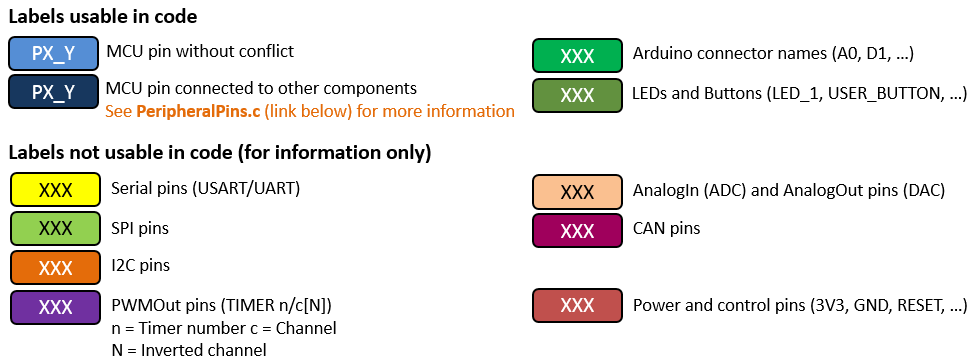
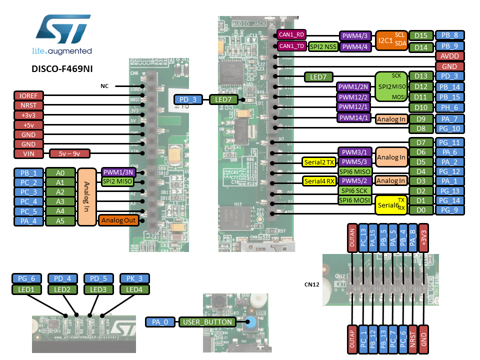

# Overview

The discovery kit enables a wide range of use cases taking advantage of
premium graphics, audio, multi-sensor support, WVGA color display,
security, memory extension and connectivity features. An embedded
ST-LINK/V2-1 debugger/programmer is included; specialized add-on boards
can be connected thanks to the **Arduino™ UNO** or to the **expansion**
connectors.

# Board pinout

## Pins Legend

# Getting started

- [Getting started guide](DM00236781.pdf)

## ST-LINK driver installation and firmware upgrade

1. Download the latest [ST-LINK driver](https://www.st.com/en/development-tools/stsw-link009.html).
2. Extract the archive and run `dpinst_amd64.exe`. Follow the displayed instructions.
3. Download the latest [ST-LINK firmware upgrade](https://www.st.com/en/development-tools/stsw-link007.html).
4. Extract the archive and run the STLinkUpgrade.exe program.
5. Connect the board to your PC using a USB cable and wait until the USB enumeration is completed.
6. In the **ST-Link Upgrade** program, press the **Device Connect** button.
7. When the ST-LINK driver is correctly installed, the current ST-LINK version is displayed.
8. Press the **Yes >>>>** button to start the firmware upgrade process.

# Technical reference

- [STM32F469NI microcontroller](https://www.st.com/web/catalog/mmc/FM141/SC1169/SS1577/LN1876/PF260683?s_searchtype=partnumber)
- [32F469IDISCOVERY board](https://www.st.com/web/catalog/tools/FM116/CL1620/SC959/SS1532/LN1848/PF262395?s_searchtype=partnumber)
- [User manual](DM00218846.pdf)
- [Data brief](DM00218382.pdf)
