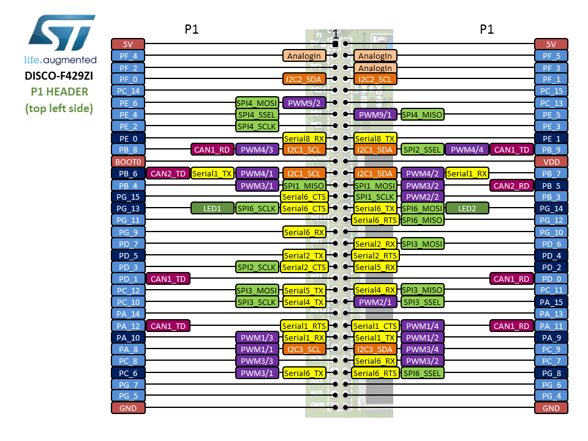
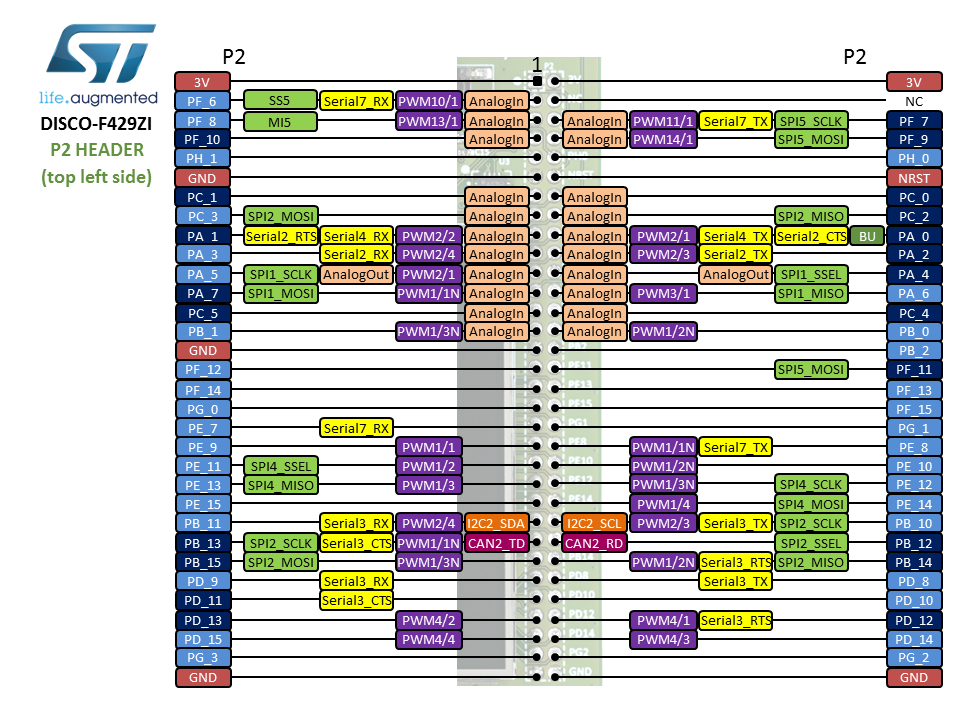
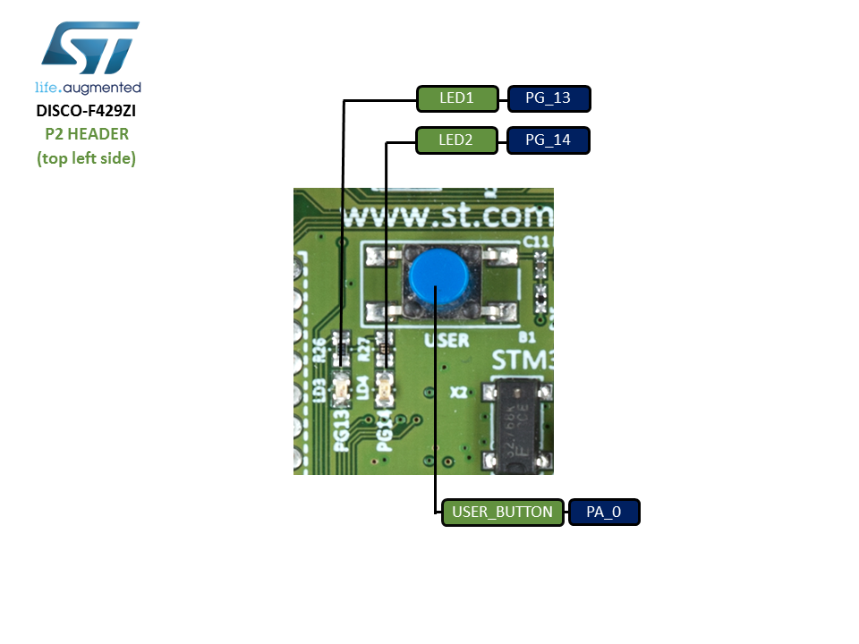

# Overview

This discovery board offers everything required for users to get started
quickly and develop applications easily. The full range of hardware
features on the board helps to evaluate almost all peripherals and
develop your own applications.

The **STM32F429I-Discovery** board includes an **ST-LINK/V2** embedded
debug tool, a 2.4" QVGA TFT LCD, an external 64-Mbit SDRAM, an ST MEMS
gyroscope, a USB OTG micro-AB connector, LEDs and push-buttons.

# Board pinout

## Pins Legend

# Schematics

- [STM32F429I-Discovery schematics](stm32f429i-disco_sch.zip)

# Getting started

- [Getting started guide](DM00092920.pdf)
- [Blinky lab](STMicroelectronics_Blinky_Lab.pdf)

## ST-LINK driver installation and firmware upgrade

1. Download the latest [ST-LINK driver](https://www.st.com/en/development-tools/stsw-link009.html).
2. Extract the archive and run `dpinst_amd64.exe`. Follow the displayed instructions.
3. Download the latest [ST-LINK firmware upgrade](https://www.st.com/en/development-tools/stsw-link007.html).
4. Extract the archive and run the STLinkUpgrade.exe program.
5. Connect the board to your PC using a USB cable and wait until the USB enumeration is completed.
6. In the **ST-Link Upgrade** program, press the **Device Connect** button.
7. When the ST-LINK driver is correctly installed, the current ST-LINK version is displayed.
8. Press the **Yes >>>>** button to start the firmware upgrade process.

# Technical reference

- [STM32F429ZI microcontroller](https://www.st.com/web/catalog/mmc/FM141/SC1169/SS1577/LN1806/PF255419)
- [DISCOVERY board](https://www.st.com/web/catalog/tools/FM116/CL1620/SC959/SS1532/LN1848/PF259090?s_searchtype=partnumber)
- [User manual](DM00093903.pdf)
